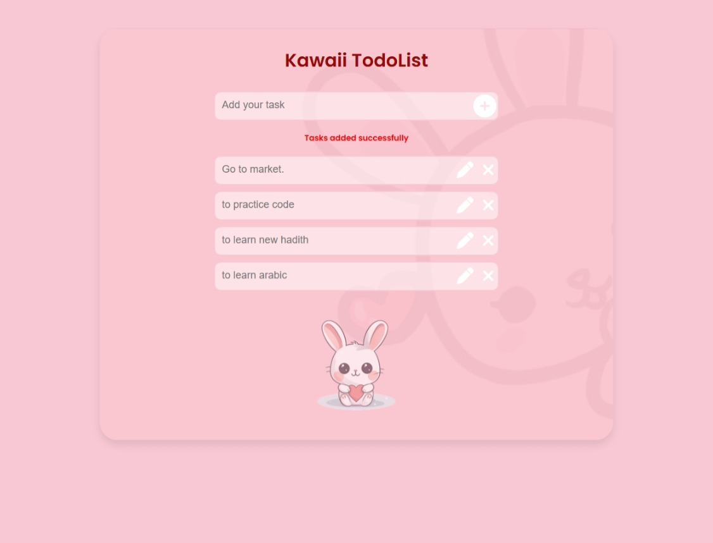

this is "kawaii-style To-Do list UI" built with only HTML and CSS. the task was to reacreate a Figma design Rounded inputs and buttons, Pink theme with a soft drop shadow,Kawaii heading fonts and center alignment, Add a bunny image at the bottom (optional)

EASY: writing basic HTML structure 

DIFFICULT: making responsive on mobile 

